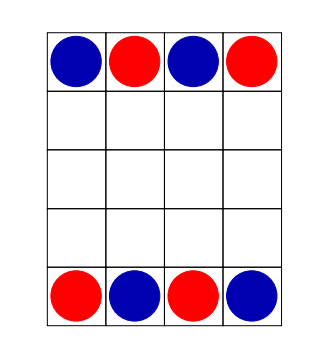

# 2.19 Game - homework project

**Description:**

Az ábrán látható módon rendezzünk el 4 kék és 4 piros korongot egy 5 × 4
mezőből álló táblán. Az egyik játékos színe a kék, a másiké a piros. Felváltva
következnek lépni, amelynek során egy saját színű korongot mozdítanak el
egy négyszomszédos üres mezőre.  Az a játékos nyer, akinek sikerül egymás
mellett függőlegesen, vízszintesen vagy átlósan elhelyezni 3 saját színű korongot.

**Languages and Plugins used:**

Java, Maven - base code 
JavaFX - User Interface elements 
Tinylog - Logging 
JUnit - Unit testing 
Jackson - Scoreboard save/load 
